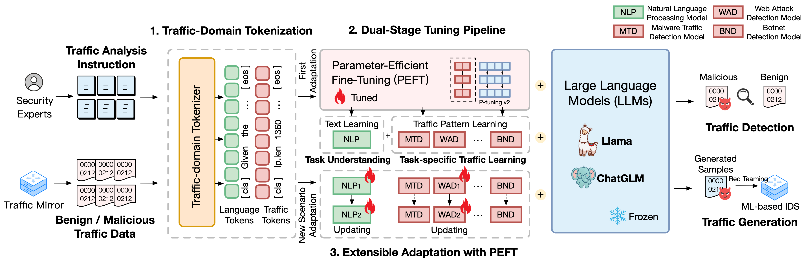

# TrafficLLM: Enhancing Large Language Models for Network Traffic Analysis with Robust Traffic Representation

The repository of **TrafficLLM**, a universal LLM adaptation framework to learn robust traffic representation for all open-sourced LLM in real-world scenarios and enhance the generalization across diverse traffic analysis tasks.



Note: this code is based on [ChatGLM2](https://github.com/THUDM/ChatGLM2-6B) and [Llama2](https://github.com/meta-llama/llama-recipes). Many thanks to the authors.

## Brief Introduction

**TrafficLLM** is built upon a sophisticated fine-tuning framework using natural language and traffic data, which proposes the following techniques to enhance the utility of large language models in network traffic analysis.

* **Traffic-Domain Tokenization.** To overcome the modality gap between natural language and heterogeneous traffic data, TrafficLLM introduces traffic-domain tokenization to process the diverse input of traffic detection and generation tasks for LLM adaptation. This mechanism effectively extends LLM’s native tokenizer by training specialized the tokenization model on large-scale traffic-domain corpora.
* **Dual-Stage Tuning Pipeline.** TrafficLLM employs a dual-stage tuning pipeline to achieve LLM’s robust representation learning across different traffic-domain tasks. The pipeline trains LLM to understand instructions and learn task-related traffic patterns at different stages, which builds upon TrafficLLM task understanding and traffic reasoning abilities for diverse traffic detection and generation tasks.
* **Extensible Adaptation with Parameter-Effective Fine-Tuning (EA-PEFT).** To adapt LLM for generalization to new traffic environments, TrafficLLM proposes an extensible adaptation with parameter-effective fine-tuning (EA-PEFT) to update model parameters with low overhead. The technique splits model capabilities in different PEFT models, which helps minimize the costs on dynamic scenarios raised by traffic pattern changes.

## Getting Started

<span id='all_catelogue'/>

### Table of Contents:

* <a href='#chapter-1'>1. Environment Preparation</a>
* <a href='#chapter-2'>2. Training TrafficLLM</a>
  * <a href='#chapter-2.1'>2.1. Preparing Pre-trained Checkpoint</a>
  * <a href='#chapter-2.2'>2.2. Preprocessing Dataset</a>
  * <a href='#chapter-2.3'>2.3. Training Traffic-Domain Tokenizer (Optional)</a>
  * <a href='#chapter-2.4'>2.4. Neural Language Instruction Tuning</a>
  * <a href='#chapter-2.5'>2.5. Task-Specific Traffic Tuning</a>
  * <a href='#chapter-2.6'>2.6. Extensible Adaptation with PEFT (EA-PEFT)</a>
* <a href='#chapter-3'>3. Evaluating TrafficLLM</a>
  * <a href='#chapter-3.1'>3.1. Preparing Checkpoints and Data</a>
  * <a href='#chapter-3.2'>3.2. Running Evaluation</a>


<span id='chapter-1'/>

### 1. Environment Preparation <a href='#all_catelogue'>[Back to Top]</a>

Please clone the repo and install the required environment by runing the following commands.

```shell
conda create -n trafficllm python=3.9

conda activate trafficllm

# Clone our TrafficLLM
git clone https://github.com/TrafficLLMv1/TrafficLLM.git
cd TrafficLLM
# Install required libraries
pip install -r requirements.txt
# If training
pip install rouge_chinese nltk jieba datasets
```

<span id='chapter-2'/>

### 2. Training TrafficLLM <a href='#all_catelogue'>[Back to Top]</a>

TrafficLLM employs three core techniques: **traffic-domain tokenization** to process instructions and traffic data, **dual-stage tuning pipeline** to understand text semantics and learn traffic patterns across different tasks, and the **EA-PEFT** to update model parameters for new scenario adaptation.

<span id='chapter-2.1'/>

#### 2.1 Preparing Pre-trained Checkpoint <a href='#all_catelogue'>[Back to Top]</a>

TrafficLLM is trained based on existing open-sourced LLMs. Please follow the instructions to prepare the checkpoints.

* `ChatGLM2`: Prepare the base model ChatGLM, which is an open-sourced LLM with light-wise deployment requirements. Please download its weights [here](https://huggingface.co/THUDM/chatglm2-6b). We generally utilize the v2 model with 6B parameters.
* `Other LLMs`: To adapt other LLMs for traffic analysis tasks, you can reuse the [training data](datasets) in the repo and modify their training scripts according to the official instructions. For instance, [Llama2](https://github.com/meta-llama/llama-recipes/blob/main/src/llama_recipes/configs/datasets.py) is required to register the new dataset in the configs.

<span id='chapter-2.2'/>

#### 2.2 Preprocessing Dataset <a href='#all_catelogue'>[Back to Top]</a>

To extract suitable training data for LLM learning from the raw traffic datasets, we design specialized extractors to preprocess traffic datasets for different tasks. The preprocessing code contain the following parameters to config.

* `input`: The raw traffic dataset path.
* `dataset_name`: The raw traffic dataset name (It helps if the name has registered in TrafficLLM's codes). 
* `traffic_task`: Detection tasks or generation tasks.
* `granularity`: Packet-level or flow-level granularity.
* `output_path`: Output training dataset path.
* `output_name`: Output training dataset name.

This is an instance to preprocess datasets for packet-level traffic detection tasks.

```shell
cd preprocess
python preprocess_dataset.py --input /Your/Raw/Dataset/Path --dataset_name /Your/Raw/Dataset/Name --traffic_task detection --granularity packet-level --output_path /Your/Output/Dataset/Path --output_name /Your/Output/Dataset/Name
```

<span id='chapter-2.3'/>

#### 2.3 Training Traffic-Domain Tokenizer (Optional) <a href='#all_catelogue'>[Back to Top]</a>

TrafficLLM introduces a traffic-domain tokenizer to handle neural language and traffic data. If you want to train a custom tokenizer with your own dataset, please modify the `model_name` and `data_path` in the [code](tokenization/traffic_tokenizer.py).

* `model_name`: The base model path that contains the native tokenizer.
* `data_path`: The training datasets extracted from the preprocessing process.

Please follow the command to use the code.

```shell
cd tokenization
python traffic_tokenizer.py
```

<span id='chapter-2.4'/>

#### 2.4 Neural Language Instruction Tuning <a href='#all_catelogue'>[Back to Top]</a>

* **Prepare data:** The neural language instruction tuning data is our collected instruction datasets for traffic analysis task understanding.
* **Start tuning:** After the aforementioned steps, you could start the first stage tuning by using [trafficllm_stage1.sh](dual-stage-tuning/trafficllm_stage1.sh). There is an example as below:

```shell
PRE_SEQ_LEN=128
LR=2e-2
NUM_GPUS=1
export CUDA_VISIBLE_DEVICES=1

torchrun --standalone --nnodes=1 --nproc-per-node=$NUM_GPUS main.py \
    --do_train \
    --train_file ../datasets/instructions/instructions.json \
    --validation_file ../datasets/instructions/instructions.json \
    --preprocessing_num_workers 10 \
    --prompt_column instruction \
    --response_column output \
    --overwrite_cache \
    --cache_dir /cache \
    --model_name_or_path ../models/chatglm2/chatglm2-6b \
    --output_dir ../models/chatglm2/peft/instruction \
    --overwrite_output_dir \
    --max_source_length 1024 \
    --max_target_length 32 \
    --per_device_train_batch_size 1 \
    --per_device_eval_batch_size 1 \
    --gradient_accumulation_steps 16 \
    --predict_with_generate \
    --max_steps 20000 \
    --logging_steps 10 \
    --save_steps 4000 \
    --learning_rate $LR \
    --pre_seq_len $PRE_SEQ_LEN
```

<span id='chapter-2.5'/>

#### 2.5 Task-Specific Traffic Tuning <a href='#all_catelogue'>[Back to Top]</a>

* **Prepare data:** The task-specific traffic tuning datasets are the training datasets extracted from the preprocessing step for different downstream tasks.
* **Start tuning:** After the aforementioned steps, you could start the second stage tuning by using [trafficllm_stage2.sh](dual-stage-tuning/trafficllm_stage2.sh). There is an example as below:

```shell
PRE_SEQ_LEN=128
LR=2e-2
NUM_GPUS=1
export CUDA_VISIBLE_DEVICES=1

torchrun --standalone --nnodes=1 --nproc-per-node=$NUM_GPUS main.py \
    --do_train \
    --train_file ../datasets/ustc-tfc-2016/ustc-tfc-2016_detection_packet_train.json \
    --validation_file ../datasets/ustc-tfc-2016/ustc-tfc-2016_detection_packet_train.json \
    --preprocessing_num_workers 10 \
    --prompt_column instruction \
    --response_column output \
    --overwrite_cache \
    --cache_dir /cache \
    --model_name_or_path ../models/chatglm2/chatglm2-6b \
    --output_dir ../models/chatglm2/peft/ustc-tfc-2016-detection-packet \
    --overwrite_output_dir \
    --max_source_length 1024 \
    --max_target_length 32 \
    --per_device_train_batch_size 1 \
    --per_device_eval_batch_size 1 \
    --gradient_accumulation_steps 16 \
    --predict_with_generate \
    --max_steps 20000 \
    --logging_steps 10 \
    --save_steps 4000 \
    --learning_rate $LR \
    --pre_seq_len $PRE_SEQ_LEN
```

<span id='chapter-2.6'/>

#### 2.6 Extensible Adaptation with PEFT (EA-PEFT) <a href='#all_catelogue'>[Back to Top]</a>

TrafficLLM employs EA-PEFT to organize the parameter-effective fine-tuning (PEFT) models with an extensible adaptation, which can help TrafficLLM easily adapt to new environments. TrafficLLM adaptor allows flexible operations to update old models or register new tasks. 

* `model_name`: The path of base model.
* `tuning_data`: The new environment dataset.
* `adaptation_task`: Update or register (update old models or register new tasks).
* `task_name`: The downstream task name to be updated or inserted.

There is an example to update TrafficLLM with malware traffic daetection (MTD) tasks.

```shell
cd EA-PEFT
python ea-peft.py --model_name /Your/Base/Model/Path --tuning_data /Your/New/Dataset/Path --adaptation_task update --task_name MTD
```

<span id='chapter-3'/>

### 3. Evaluating TrafficLLM <a href='#all_catelogue'>[Back to Top]</a>

<span id='chapter-3.1'/>

#### 3.1 Preparing Checkpoints and Data <a href='#all_catelogue'>[Back to Top]</a>

* **Checkpoints:** You could try to evaluate TrafficLLM by using your own model or our released checkpoints.
* **Data:** During the preprocessing step, we split test datasets and build label files for different datasets for evaluation. Please refer to the [preprocessing codes](preprocess/preprocess_dataset.py).

<span id='chapter-3.2'/>

#### 3.2 Running Evaluation <a href='#all_catelogue'>[Back to Top]</a>

To measure TrafficLLM's effectiveness for different downstream tasks, please run the [evaluation codes](evaluation.py).

* `model_name`: The path of base model.
* `traffic_task`: Detection tasks or generation tasks.
* `test_file`: The test datasets extracted during preprocessing steps.
* `label_file`: The label file extracted during preprocessing steps.
* `ptuning_path`: The PEFT model path for task-specific evaluation.

There is an example to run evaluation on MTD tasks.

```shell
python evaluation.py --model_name /Your/Base/Model/Path --traffic_task detection --test_file datasets/ustc-tfc-2016/ustc-tfc-2016_detection_packet_test.json --label_file datasets/ustc-tfc-2016/ustc-tfc-2016_label.json --ptuning_path models/chatglm2/peft/ustc-tfc-2016-detection-packet/checkpoints-20000/
```


## Acknowledgements

Many thanks to the related work [ChatGLM2](https://github.com/THUDM/ChatGLM2-6B) and [Llama2](https://github.com/meta-llama/llama-recipes) that serves as foundations for our framework and codes. The design of building TrafficLLM is inspired by [ET-BERT](https://github.com/linwhitehat/ET-BERT) and [GraphGPT](https://github.com/HKUDS/GraphGPT). Thanks for their wonderful works.


