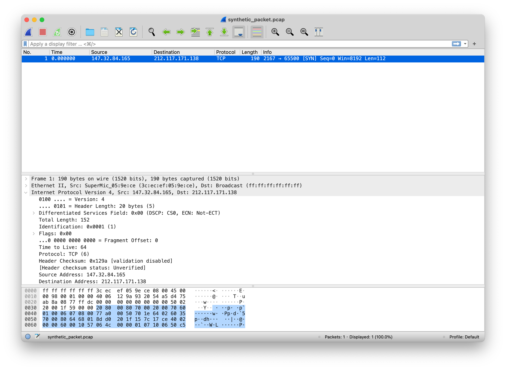

# Generating Packets with TrafficLLM and Scapy
In this tutorial, we will see how we can leverage TrafficLLM to generate a pcap file of packets with the help of [Scapy](https://scapy.net/). We need:
* The base model to build TrafficLLM: https://huggingface.co/THUDM/chatglm2-6b or other LLMs
* The tuning checkpoints for traffic generation tasks: https://github.com/TrafficLLMv1/TrafficLLM/tree/master/models/chatglm2/peft
* The environments that installed Scapy: https://scapy.net/

We use the `Malware Traffic Generation` task as an example. The checkpoints for generation tasks are trained by following [the training steps](https://github.com/TrafficLLMv1/TrafficLLM?tab=readme-ov-file#getting-started). You can follow the instructions to build your custom traffic generation capabilities.

## 1. Preparation
Please clone the repo and install the required environment by runing the following commands.
```shell
conda create -n trafficllm python=3.9

conda activate trafficllm

# Clone our TrafficLLM
git clone https://github.com/TrafficLLMv1/TrafficLLM.git
cd TrafficLLM
# Install required libraries
pip install -r requirements.txt
# If training
pip install rouge_chinese nltk jieba datasets

```

## 2. Creating Directories
The traffic generation tasks are required to create working directories to store the running data during generation.
```shell
cd tutorials
mkdir tmp 
mkdir tmp/packet_generation tmp/flow_generation
```

## 3. Registering Tasks and Checkpoints
After getting the checkpoints of traffic generation tasks, we can add the task name and checkpoints in the [config](config.json). TrafficLLM encapsulates traffic generation capabilities into two parts: header generation and payload generation.
```shell
{
    "model_path": "../models/chatglm2/chatglm2-6b/",
    "peft_path": "../models/chatglm2/peft/",
    "peft_set": {
      "NLP": "instruction-new/checkpoint-8000/",
      "MTD": "ustc-tfc-2016-detection-packet/checkpoint-10000/",
      "BND": "iscx-botnet-2014-detection-packet/checkpoint-5000/",
      "WAD": "csic-2010-detection-packet/checkpoint-6000/",
      "AAD": "dapt-2020-detection-packet/checkpoint-20000/",
      "EVD": "iscx-vpn-2016-detection-packet/checkpoint-4000/",
      "TBD": "iscx-tor-2016-detection-packet/checkpoint-10000/",
      "MTG": ["ustc-tfc-2016-generation-packet-header/checkpoint-10000/",
      "ustc-tfc-2016-generation-packet-payload/checkpoint-10000/"] # Add generation checkpoints
    },
    "tasks": {
      "Malware Traffic Detection": "MTD",
      "Botnet Detection": "BND",
      "Web Attack Detection": "WAD",
      "APT Attack Detection": "AAD",
      "Encrypted VPN Detection": "EVD",
      "Tor Behavior Detection": "TBD",
      "Malware Traffic Generation": "MTG" # Add generation task names
    }
}
```

## 4. Generating Pcap Files
We can now use the [generation code](generation.py) to generate the traffic with the **terminal mode**. Here is an example to generate a packet of `Neris`.

```shell
python generation.py --config=config.json --prompt='Please generate a packet of Neris traffic.'
```

TrafficLLM will generate the hexadecimal data in the `tmp` directory and use `scapy` to build the pcap file `synthetic_packet.pcap`. 

Traffic can use the target label to generate the corresponding categories of traffic. Each label refers to the open-sourced datasets we used during training. The Ethernet layer is synthesized by Scapy, which has no meaning.
```shell
$ python generation.py --config=config.json --prompt='Please generate a packet of Neris traffic.'
Loading checkpoint shards: 100%|██████████████████████████████████████████████████████████████████████████████████████████████████████████████████████████████████████████████████████████████████████████████████████████████████████████████████████████████████████████████████████████████████████████████████████████████████████████████████████████████████████████████████████████████████████████████| 7/7 [00:06<00:00,  1.07it/s]
Some weights of ChatGLMForConditionalGeneration were not initialized from the model checkpoint at /mnt/data/cty/models/chatglm2/chatglm2-6b/ and are newly initialized: ['transformer.prefix_encoder.embedding.weight']
You should probably TRAIN this model on a down-stream task to be able to use it for predictions and inference.
Malware Traffic Generation
{'src': '147.32.84.165', 'dst': '212.117.171.138', 'proto': 6, 'sport': 2167, 'dport': 65500}
2080008070002000706001000607080077a00050701e640260357000806468018dd0201f157c17ce4002000060001057064c00000107100650c556ee225c1004004506010035065c8600e3d6e45677f2fd65f044ccd5c41a507e0e00640e0ac4ff20141450000e017bd4decefe7ae4da6fe07a20dba7cee280e5d50eed4dee0d772e0f61f1e0ae2e

WARNING: getmacbyip failed on [Errno 1] Operation not permitted
WARNING: Mac address to reach destination not found. Using broadcast.
0000  FF FF FF FF FF FF 3C EC EF 05 9E CE 08 00 45 00  ......<.......E.
0010  00 98 00 01 00 00 40 06 12 9A 93 20 54 A5 D4 75  ......@.... T..u
0020  AB 8A 08 77 FF DC 00 00 00 00 00 00 00 00 50 02  ...w..........P.
0030  20 00 1F 59 00 00                                 ..Y..
WARNING: getmacbyip failed on [Errno 1] Operation not permitted
WARNING: Mac address to reach destination not found. Using broadcast.
###[ Ethernet ]###
  dst       = ff:ff:ff:ff:ff:ff
  src       = 3c:ec:ef:05:9e:ce
  type      = IPv4
###[ IP ]###
     version   = 4
     ihl       = None
     tos       = 0x0
     len       = 152
     id        = 1
     flags     =
     frag      = 0
     ttl       = 64
     proto     = tcp
     chksum    = None
     src       = 147.32.84.165
     dst       = 212.117.171.138
     \options   \
###[ TCP ]###
        sport     = 2167
        dport     = 65500
        seq       = 0
        ack       = 0
        dataofs   = None
        reserved  = 0
        flags     = S
        window    = 8192
        chksum    = None
        urgptr    = 0
        options   = ''

WARNING: more getmacbyip failed on [Errno 1] Operation not permitted
WARNING: more Mac address to reach destination not found. Using broadcast.
Input from: tmp/packet_generation/hexdump
Output to: synthetic_packet.pcap
Output format: pcap
Start new packet (cont = FALSE).
[[parse_preamble: ""]]
Wrote packet of 190 bytes.

-------------------------
Read 1 potential packet, wrote 1 packet (230 bytes).
```

The generated packets can be loaded by `tshark` and `wireshark`, which can be used for further analysis.
```shell
$ tshark -r synthetic_packet.pcap
    1   0.000000 147.32.84.165 → 212.117.171.138 TCP 190 2167 → 65500 [SYN] Seq=0 Win=8192 Len=112
```

